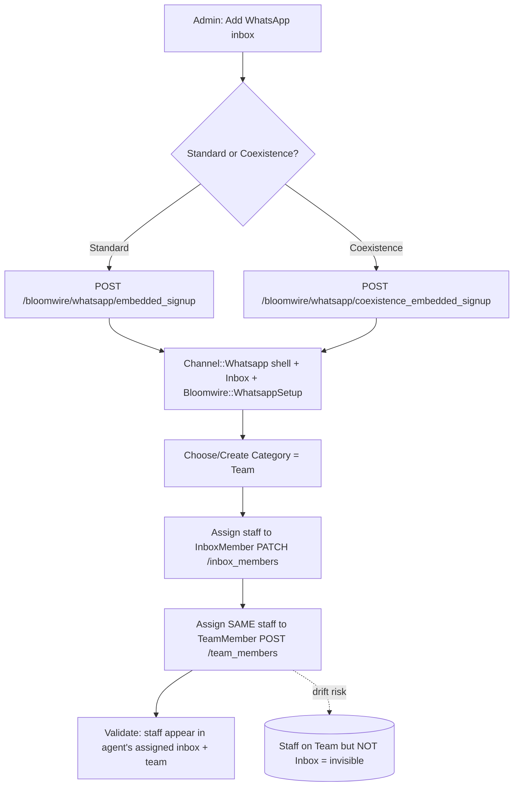
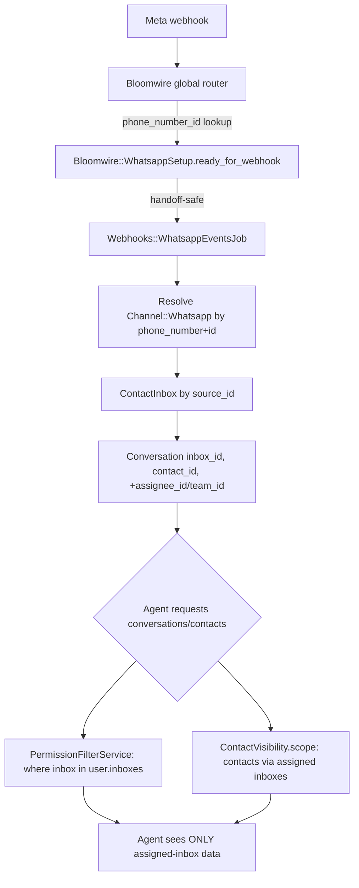
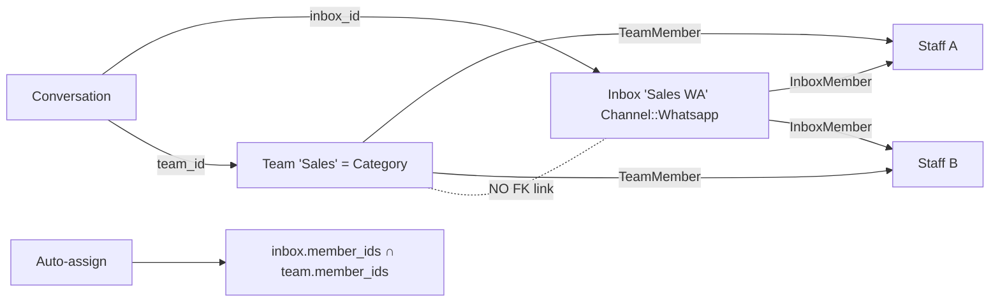

# Phase 17F.0 — Multi‑WhatsApp‑Inbox / Category Admin UI — Discovery & Implementation Plan

**Type:** Discovery + Planning (docs‑only). **No product code, no migrations, no deploy, no real Meta/WhatsApp/Shopify.**
**Base branch:** `version_1` · **Base SHA:** `096f619020a3102c404053a5a9832cd5fcbdfb1b`
**DEV runtime code SHA:** `4525bea6baf8c17315436982f0d70106508b9c57` · **DEV:** https://dev.unecast.com
**Method:** static code inspection (4 read‑only sub‑agents) + authenticated DEV admin runtime inspection (Chrome DevTools MCP, PHI masked).

---

## 1. Executive summary

Bloomwire needs an **admin experience for managing multiple WhatsApp inboxes, business categories/departments, and assigned staff**. The good news from discovery: **every primitive already exists in Chatwoot** — Inboxes (`Channel::Whatsapp`), Teams, Users/AccountUsers, `InboxMember`, `TeamMember`, Conversations (`inbox_id` / `assignee_id` / `team_id`), and the Bloomwire managed WhatsApp onboarding (Standard + Coexistence) + isolation gates. **No new Category entity is required or recommended.**

The single most important architectural finding: **`Inbox` and `Team` are completely independent — there is NO foreign key, no `team_id` on `inboxes`, and no join table.** Therefore "Business Category/Department = Team + one‑or‑more Inbox associations" can only be realised **by convention** today: name a `Team` as the category, and add the same staff to **both** the Team (`TeamMember`) and the inbox(es) (`InboxMember`). Chatwoot's own auto‑assignment already relies on the **intersection** `inbox.member_ids ∩ team.member_ids`. The DEV account already does this informally (Teams named **"Area 1"/"Area 2"** used as the conversation folders).

Because the primitives, backend policies, and edit screens already exist and are correct, **the right move is composition, not a rebuild**. Recommended UX: **Option C (Hybrid)** — a thin Bloomwire **"Categories & Inboxes" overview** page that reads existing stores and **deep‑links into the existing Chatwoot inbox/team/agent edit screens**, plus a **guided "add WhatsApp inbox → assign to category(team) → assign staff to both memberships"** flow that stitches existing endpoints and **closes the membership‑drift gap** (the only real gap). This maximises reuse, keeps backend permissions authoritative, and leaves future channels open.

**Go/No‑Go for 17F.1: GO** (read‑only overview slice first; zero schema risk).

---

## 2. Current architecture map

| Concern | Chatwoot primitive | Bloomwire layer | Notes |
|---|---|---|---|
| WhatsApp channel | `Channel::Whatsapp` (`provider_config` jsonb, **encrypted**) | managed embedded signup (Standard/Coexistence) | Standard vs Coexistence = `provider_config['connection_mode']=='coexistence'` |
| Inbox | `Inbox` (belongs_to channel) | `Bloomwire::WhatsappSetup` routing/status map | non‑secret map: account/inbox/channel + `phone_number_id`/`waba_id` + `setup_status` |
| Category / Department | **`Team`** (name + `allow_auto_assign`) | *(convention only — no FK to Inbox)* | DEV uses "Area 1"/"Area 2" today |
| Inbox access | `InboxMember` (user↔inbox) | isolation gate scopes agents | `user.assigned_inboxes` (admin = all) |
| Team membership | `TeamMember` (user↔team) | — | drives team auto‑assign candidate pool |
| Staff | `User` + `AccountUser` (role `agent`/`administrator`) | agent/team mgmt is **business‑admin‑owned** (11B.7B) | `AgentBuilder` invite/create |
| Conversation | `Conversation` (`inbox_id`, `assignee_id`, `team_id`) | isolation via policy/finder | `assignee_id`/`team_id` are indexed but **convention‑only (no FK)** |
| Contact | `Contact` + `ContactInbox` | `Bloomwire::ContactVisibility.scope` | agent scoped to contacts reachable via assigned inboxes |
| Inbound routing | `Webhooks::WhatsappEventsJob` | global webhook router (`phone_number_id → Bloomwire::WhatsappSetup`) | fail‑closed; hands off to the existing job |

**DEV gate state (verified read‑only, all ON):** `BLOOMWIRE_MODE_ENABLED`, `MANAGED_WHATSAPP_ONBOARDING`, `GLOBAL_WEBHOOK_ROUTER`, `RESTRICT_NATIVE_WHATSAPP_SETUP`, `RESTRICT_ACCOUNT_ADMIN`, `RESTRICT_PROVIDER_SETUP`, `RESTRICT_BOT_MANAGEMENT`, `RESTRICT_AGENT_CONTACT_VISIBILITY`, `PRIVACY_HARDENING` = **true**.

---

## 3. Exact code evidence (file paths)

### 3.1 Inbox management
- Routes: `app/config/routes.rb` — `resources :inboxes` (index/show/create/update/destroy + members `assignable_agents`, `set_agent_bot`, …); `resources :inbox_members` (create/show + collection `update`/`destroy`); `namespace :bloomwire { namespace :whatsapp { resource :embedded_signup; resource :coexistence_embedded_signup } }`.
- Controller: `app/app/controllers/api/v1/accounts/inboxes_controller.rb` — before_actions: `restrict_native_whatsapp_setup!` (create/update), `restrict_external_provider_channel_setup!` (create/update), `restrict_inbox_creation!` (create), `restrict_managed_provider_inbox_destroy!` (destroy), `restrict_bot_management!` (agent_bot/set_agent_bot), `check_authorization`.
- Members: `app/app/controllers/api/v1/accounts/inbox_members_controller.rb` — `authorize @inbox, :create?/:update?/:destroy?`; `Inbox#add_members` / `#remove_members`.
- Policy: `app/app/policies/inbox_policy.rb` — `index? => true`; `show? => Current.user.assigned_inboxes.include?(record)`; `create?/update?/destroy?/set_agent_bot? => @account_user.administrator?`; `Scope#resolve => user.assigned_inboxes`.
- Managed signup services: `app/app/services/bloomwire/whatsapp_embedded_signup_service.rb` (Standard) and `.../whatsapp_coexistence_embedded_signup_service.rb` (`CONNECTION_MODE='coexistence'`). Both: build credential‑less `Channel::Whatsapp` shell → `Inbox.create!` → `Bloomwire::WhatsappCredentialWriter` (encrypted) → `Bloomwire::WhatsappSetupCreator` mapping.
- Map model: `app/app/models/bloomwire/whatsapp_setup.rb` — `SETUP_STATUSES=%w[pending configured ready_for_webhook blocked]`; unique `phone_number_id`/`channel_whatsapp_id`.
- Frontend: routes `app/app/javascript/dashboard/routes/dashboard/settings/inbox/inbox.routes.js` (all `permissions:['administrator']`); `Index.vue` (list), `ChannelList.vue` (channel cards, gated by Bloomwire capabilities), `ChannelFactory.vue` (→ `channels/BloomwireWhatsapp.vue` when `canSelfServeManagedWhatsapp`), `Settings.vue` (tabs incl. `CollaboratorsPage`), `AddAgents.vue`. Store `store/modules/inboxes.js` (+ `createBloomwireWhatsAppEmbeddedSignup` / `…Coexistence…`); `store/modules/inboxMembers.js`; API `api/inboxMembers.js` → `PATCH /inbox_members {inbox_id,user_ids}`; `api/channel/whatsappChannel.js`.

### 3.2 Teams / category
- Models: `app/app/models/team.rb` — `has_many :team_members`, `:members through`, `:conversations` (dependent: nullify). **No inbox association.** `app/app/models/inbox.rb` — `has_many :inbox_members`, `:members`, `:conversations`, `:contact_inboxes`… **No team association.**
- **Schema proof:** `app/db/schema.rb` `inboxes` table has **no `team_id`**; no `inboxes_teams`/`inbox_teams` join anywhere. **Inbox↔Team independent.**
- Conversation: `app/app/models/conversation.rb` — `assignee_id:integer`, `team_id:bigint`; `belongs_to :assignee`/`:team` (optional). Indexed, **no FK**.
- Controllers/policies: `teams_controller.rb`, `team_members_controller.rb`; `team_policy.rb` + `team_member_policy.rb` — `create?/update?/destroy? => administrator?`.
- Auto‑assign intersection: `app/app/models/concerns/assignment_handler.rb#find_assignee_from_team` → `inbox.member_ids_with_assignment_capacity & team.members.ids`.
- Frontend: `routes/dashboard/settings/teams/` (`CreateTeam.vue`→`AddAgents.vue`→finish, 2‑step; **no inbox selection**), `store/modules/teams/*`, `api/teams.js` (`/team_members`).

### 3.3 Staff / agents + permissions
- `app/app/models/account_user.rb` — `enum role:{agent:0,administrator:1}`; `permissions`. `app/app/models/user.rb` — `inboxes through inbox_members`, `teams through team_members`, `assigned_inboxes` (admin=all).
- `agents_controller.rb` + `user_policy.rb` (create/update/destroy/bulk_create => administrator). `app/app/builders/agent_builder.rb` (find_or_create User + AccountUser). **11B.7B:** agent/team mgmt is business‑admin‑owned (not Ops‑restricted).
- Base authz: `app/app/controllers/api/base_controller.rb#check_authorization` (Pundit `authorize`), `app/app/policies/application_policy.rb`.
- Bloomwire gates: `app/lib/bloomwire/features.rb`. Enforcement concerns: `restricts_account_control_plane.rb` (blocks **admin** on `AccountsController#update`, `WebhooksController`), `restricts_native_whatsapp_setup.rb` (blocks **all** on inbox WhatsApp create/update + `Whatsapp::AuthorizationsController`), `restricts_provider_setup.rb` (blocks external channel + **inbox creation for admin** via `restrict_inbox_creation!`, Shopify/Twilio/Slack/OAuth…), `restricts_bot_management.rb` (bot endpoints).

### 3.4 Isolation + routing
- `app/app/policies/conversation_policy.rb` (`inbox_access?`/`team_access?`/`assigned_to_user?`); `app/app/finders/conversation_finder.rb` (`set_inboxes` → `assigned_inboxes`); `app/app/services/conversations/permission_filter_service.rb` (admin ⇒ all; agent ⇒ `where(inbox: user.inboxes)`).
- `app/app/services/bloomwire/contact_visibility.rb` (`scope` + `restricted_for?`); `contacts_controller.rb#contacts_scope`. 17E.4 hardened: `actions/contact_merges_controller.rb`, `conversations_controller.rb#contact`, `integrations/shopify_controller.rb#contact`.
- Router: `app/app/controllers/bloomwire/webhooks/whatsapp_controller.rb`, `app/app/services/bloomwire/webhooks/whatsapp_router.rb` (`phone_number_id` → `Bloomwire::WhatsappSetup.ready_for_webhook` → `Webhooks::WhatsappEventsJob`).

---

## 4. Current runtime UX findings (authenticated DEV admin, masked)

Pages inspected (account 1, admin/owner session): dashboard; `settings/inboxes/list`; `settings/inboxes/1` (edit tabs); `settings/inboxes/new/whatsapp` (Standard/Coexistence); `settings/teams/list`; `settings/agents/list`; `contacts`.

- **Information architecture:** flat settings list — *Account Settings · Agents · Teams · Inboxes · Labels · Custom Attributes · Automation · Macros · Canned Responses · Conversation Workflow*. **There is no single place that shows "a category, its WhatsApp inbox(es), and its staff" together.**
- **Inboxes:** 1 inbox ("Bloomwire WA Dev"); edit page exposes tabs (Configuration/Collaborators/Business hours/CSAT/Bot/…). The **Collaborators** tab is where `InboxMember` is set (multiselect → `PATCH /inbox_members`).
- **WhatsApp setup:** Standard ("Register New Number") + Coexistence ("Connect Existing WhatsApp Business App") both **visible & "Available now"** (no "coming soon"). Managed self‑serve is the admin path; native is blocked.
- **Teams:** 2 teams ("Area 1"/"Area 2") already used as pseudo‑categories/folders. Team wizard = *create team → add agents*; **no inbox selection** — nothing ties a team to its inbox(es).
- **Agents:** 8 agents, roles Administrator/Agent, invite CTA present; no secrets exposed.
- **Confusing flows / duplicate steps:** to onboard one "department" today an admin must visit **3 disconnected screens** (create inbox via WhatsApp wizard; create/select a Team; open inbox → Collaborators to add staff; open Team → add the *same* staff). Membership must be entered **twice** with no cross‑check. No badge for Standard/Coexistence, setup status, or "team without an inbox / staff without inbox access".
- **States observed:** no 5xx; 0 console errors; 0 `graph.facebook.com`; contacts list renders (admin sees all).

*Evidence: masked screenshots captured this phase (Agents list, emails redacted, avatars blurred) + prior 17E.3D/17E.4D WhatsApp Standard/Coexistence screenshots. All PHI masked.*

---

## 5. Permission matrix (backend‑enforced; verified in code)

Legend: ✅ allowed · ❌ blocked (403/Pundit) · 🔒 backend‑enforced (not UI‑only).

| Capability | Bloomwire Super Admin (`/super_admin`) | Business Owner / **Account Administrator** | Business **Agent** |
|---|---|---|---|
| List all account inboxes | n/a (platform) | ✅ (policy_scope = all) 🔒 | ✅ but **only assigned** (`assigned_inboxes`) 🔒 |
| Create native inbox / native WhatsApp | n/a | ❌ `restrict_native_whatsapp_setup!` + `restrict_inbox_creation!` (gates ON) 🔒 | ❌ (admin‑only anyway) 🔒 |
| **Create WhatsApp inbox via managed embedded signup (Standard/Coexistence)** | n/a | ✅ (sanctioned managed path; separate controller) 🔒 | ❌ |
| Edit / delete inbox | n/a | ✅ (admin) but managed‑provider destroy ❌ when gated 🔒 | ❌ 🔒 |
| Manage `InboxMember` | n/a | ✅ (admin) 🔒 | ❌ 🔒 |
| Create/edit/delete Team, manage `TeamMember` | n/a | ✅ (business‑admin‑owned, 11B.7B) 🔒 | ❌ 🔒 |
| Create/invite/edit/delete agents | n/a | ✅ (business‑admin‑owned) 🔒 | ❌ 🔒 |
| Provider/bot setup (Shopify/Twilio/Slack/OAuth, agent bots) | n/a | ❌ `restrict_provider_setup!` / `restrict_bot_management!` 🔒 | ❌ 🔒 |
| Account settings / webhooks | n/a | ❌ `restrict_account_control_plane!` (gate ON) 🔒 | ❌ 🔒 |
| See conversations | n/a | ✅ all (PermissionFilterService bypass) 🔒 | ✅ **only assigned‑inbox** 🔒 |
| See contacts | n/a | ✅ all 🔒 | ✅ **only reachable via assigned inboxes** (`ContactVisibility`) 🔒 |
| Merge/attach/Shopify‑orders for a contact | n/a | ✅ all 🔒 | ✅ **only in‑scope** (17E.4: 404/422) 🔒 |

**Conclusion:** the admin‑vs‑agent boundary the UI needs is **already enforced in the backend**. 17F UI is a *composition of already‑authorized actions*; frontend hiding is convenience, not security.

---

## 6. Data‑flow diagrams (Mermaid)

### 6.1 Admin onboarding a category (target composed flow)

### 6.2 Inbound message → agent isolation (existing runtime)

### 6.3 Category = Team + Inbox (convention, no FK)

---

## 7. Gap analysis

1. **No Inbox↔Team link (structural).** Category↔inbox is convention‑only; nothing records "which inboxes belong to this category". *(Primary gap.)*
2. **Membership drift.** Staff can be on a Team but not its Inbox (⇒ invisible to them) or on an Inbox but not the Team (⇒ excluded from team auto‑assign). Nothing warns.
3. **No unified surface.** Admin juggles 3 screens + double‑enters membership.
4. **No status/typing badges.** Standard vs Coexistence, `Bloomwire::WhatsappSetup.setup_status` (pending/configured/ready_for_webhook/blocked), "category without inbox", "staff without inbox access" are invisible in the UI.
5. **Agent category view.** Agents have conversation/contact isolation but no "my category/inbox" summary.
6. **Everything backend‑correct.** Policies, gates, routing, isolation already right — so scope is UI composition + one lightweight mapping decision, not new backend security.

---

## 8. UX option comparison

| Criterion | A: Separate existing pages | B: Full unified Bloomwire page | **C: Hybrid (compose + deep‑link)** |
|---|---|---|---|
| Code reuse | High (nothing new) | Low (re‑implements editors) | **High (overview + reuse editors)** |
| Security | ✅ (existing policies) | ⚠️ risk of re‑implementing authz | ✅ (existing policies unchanged) |
| Usability | ❌ fragmented, double entry | ✅ best, but heavy | ✅ good (one overview + guided flow) |
| Impl risk | Low | **High** (big new surface) | **Low–Med** |
| Responsive | existing | new work | mostly existing |
| Maintainability | ok but drift stays | ⚠️ diverges from upstream | ✅ minimal delta from upstream |
| Future channels | ✅ | ⚠️ tends to hard‑code WhatsApp | ✅ (channel‑agnostic overview) |

---

## 9. Recommended UX — **Option C (Hybrid)**

Build a Bloomwire **"Categories & Inboxes" overview** (admin) that:
- lists **Teams as categories**, each showing its **linked WhatsApp inbox(es)**, **staff**, **Standard/Coexistence badge**, and **setup status** (from `Bloomwire::WhatsappSetup`);
- **deep‑links** to the existing Chatwoot editors (inbox settings, team members, agents) for all edits — **no re‑implemented editors**;
- adds a **guided "Add WhatsApp inbox → assign to category(team) → assign staff to both memberships"** wizard that composes the existing managed‑signup + `inbox_members` + `team_members` endpoints and **assigns membership once, to both**, eliminating drift;
- surfaces **drift warnings** ("staff on team but not inbox", "category without inbox").
- **Agent** gets a read‑only "My categories/inboxes" panel driven entirely by existing scoped endpoints.

**Category↔Inbox link decision (key):** avoid a new entity. Options, in order of preference — (a) **reuse an existing per‑inbox data field** to store the linked `team_id` (a *data tag*, not a new model — smallest change; if `Inbox` lacks a jsonb field, a single nullable column is a minimal, non‑entity migration deferred to 17F.4 and explicitly not a "Category table"); (b) pure **convention** (name match + membership overlap) with no storage (weakest — can't reliably answer "which inboxes are in this category"). **Recommend (a)**, decided in 17F.4; 17F.1 ships read‑only using convention/derivation so it is zero‑risk.

---

## 10. Implementation slices (derived from evidence)

> Feature‑flagged under a new `BLOOMWIRE_CATEGORY_ADMIN_UI` toggle (OFF ⇒ stock Chatwoot screens unchanged). Vertical, independently reviewable.

**17F.1 — Admin "Categories & Inboxes" overview (read‑only).**
- Scope: new admin settings page composing existing stores (teams, inboxes, `Bloomwire::WhatsappSetup` status DTO) into a category→inbox(es)→staff table with badges; deep‑links to existing editors. No writes.
- Backend: a **read‑only** DTO/serializer for setup status + (safe) inbox/team/member summaries (reuse existing indices; admin‑only policy). No schema.
- Frontend: new Vue page + Pinia/store composition + route (`permissions:['administrator']`). Reuse `SettingsLayout`, badges, `ChannelIcon`.
- Tests: request/policy spec (admin 200 / agent 403 / feature‑OFF 404); serializer safe‑DTO spec (no secrets); component + store tests.
- Acceptance: admin sees all categories(teams) + their inboxes + staff + Standard/Coexistence + status; agent cannot load it; OFF ⇒ page absent, stock unaffected.
- Runtime: authenticated DEV admin renders; agent blocked (403).
- Rollback: toggle OFF removes the route/page. Exclusions: no edits, no mapping storage yet.

**17F.2 — Guided "Add WhatsApp inbox to a category" flow.**
- Scope: wizard composing managed embedded signup (Standard/Coexistence) → pick/create Team → assign staff → **write both** `InboxMember` + `TeamMember` in one step.
- Backend: none new (reuse embedded‑signup + `inbox_members` + `team_members`); optional thin orchestration service (admin‑only) that calls existing endpoints atomically. No schema. No real Meta (mock at seam in tests).
- Frontend: wizard reusing `BloomwireWhatsapp.vue` + team select + agent multiselect.
- Tests: service/request specs (dual membership written; admin‑only; Meta mocked); no‑real‑Meta assertion; component tests.
- Acceptance: one flow yields inbox + team + staff on both memberships; agent immediately sees the inbox/conversations/contacts.
- Rollback: toggle OFF ⇒ fall back to separate stock screens. Exclusions: no real Meta connection.

**17F.3 — Unified staff‑membership management for a category.**
- Scope: one screen to manage a category's staff that writes `InboxMember` **and** `TeamMember` together; shows/fixes drift.
- Backend: reuse `inbox_members` + `team_members`; optional orchestration + a **read‑only drift report** (admin‑only). No schema.
- Tests: request/policy + drift‑detection specs; admin vs agent.
- Acceptance: adding/removing staff updates both memberships; drift warnings resolve. Rollback: toggle OFF.

**17F.4 — Category↔Inbox mapping + enforcement (the mapping decision).**
- Scope: implement the **explicit, non‑entity** category→inbox link (recommended: store `team_id` on the inbox via an existing/added data field — NOT a Category table) so the overview is reliable; enforce admin‑only writes + agent‑scoped reads via existing policies.
- Backend: minimal, reversible migration **only if** no reusable field exists (single nullable `inbox.category_team_id` or jsonb tag) — reviewed as a data tag, explicitly not a new entity; update overview/derivation to use it.
- Tests: model/validation, policy, request; feature‑OFF stock behavior; migration/schema guard reviewed.
- Acceptance: overview reflects the stored link; agents never see cross‑category data. Rollback: toggle OFF + reversible migration. **This is the only slice that may touch schema — gated + owner‑approved separately.**

**17F.5 — UI states, responsive, empty/error polish** (see §11 states). No backend. Tests: component/story + responsive smoke.

**17F.6 — Authenticated DEV E2E validation** (admin + agent, gate ON): overview, guided add (mock Meta), dual membership, isolation, drift; masked screenshots; cleanup synthetic data; no real Meta/Shopify.

---

## 11. TDD & testing plan

- **Backend:** request/controller specs (admin 200 / agent 403 / feature‑OFF 404) for the overview + orchestration; **policy specs** (Inbox/Team/User/Conversation/Contact) proving admin‑all vs agent‑scoped; **service specs** for the compose/orchestration + drift report; **safe‑DTO specs** (no `provider_config`/token/secret in any response); **feature‑OFF** specs (stock screens unchanged); **no‑real‑Meta** strategy = stub `Whatsapp::TokenExchangeService`/`PhoneInfoService`/`FacebookApiClient` + `WebMock.disable_net_connect!` (as in 17E.3) and assert no `graph.facebook.com`.
- **Frontend:** component tests (overview table, badges, drift banners, wizard steps, empty/loading/error), store/API tests (composition, membership writes), permission‑driven rendering.
- **Multi‑inbox runtime E2E:** extend `app/spec/integration/bloomwire/multi_inbox_runtime_e2e_spec.rb` to cover category(team)↔inbox composition + dual membership + agent isolation with the gate ON.
- **Responsive/browser smoke:** authenticated DEV (MCP), masked; admin vs agent; mobile/tablet breakpoints.
- **RED‑first** where a behavior is added (e.g., drift detection, orchestration atomicity).

---

## 12. Risks & mitigations

| Risk | Evidence | Mitigation |
|---|---|---|
| Team/Inbox membership drift | no FK; parallel `InboxMember`/`TeamMember` | 17F.2/17F.3 write **both** at once + drift report/warnings |
| Staff on Team but not Inbox (invisible) | isolation keys off `assigned_inboxes` | dual‑write + validation before "done" |
| Staff on Inbox but not Team (no team auto‑assign) | `inbox∩team` intersection | drift report; surface in overview |
| Deleting an Inbox with conversations | `inbox has_many :conversations dependent: :destroy_async` | destructive‑confirm + managed‑destroy gate (already ❌ when gated); warn on count |
| Deleting a Team with conversations | `team has_many :conversations dependent: :nullify` | destructive‑confirm; note conversations keep history, lose team |
| One Inbox ↔ many Teams / one Team ↔ many Inboxes | no FK ⇒ many‑to‑many possible | pick a **policy** (recommend 1 inbox → 1 category(team); many inboxes per team allowed) enforced in 17F.4 |
| Shared contacts across inboxes | `ContactInbox` many‑to‑one contact | isolation already via `ContactVisibility` (reachable set) — no change |
| Admin exposing cross‑category data | admin bypasses agent scope by design | overview is admin‑only; agent view uses scoped endpoints only |
| Standard vs Coexistence lifecycle differences | `connection_mode` in `provider_config` | badge + status from `Bloomwire::WhatsappSetup`; don't assume identical readiness |
| Upstream Chatwoot upgrade later | composition minimises fork delta | Option C deep‑links stock editors; keep Bloomwire surface thin + flagged |
| New schema creep ("Category table") | architecture rule forbids | 17F.1–17F.3 need **no** schema; 17F.4 mapping is a **data tag**, owner‑approved, reversible |

---

## 13. Explicit non‑goals

- No new Category model/table/entity. No duplication of contacts/conversations/messages.
- No new channel beyond WhatsApp (keep channel‑agnostic where cheap; don't build other channels).
- No change to backend authorization/gates (compose existing). No frontend‑only "security".
- No rebuild of WhatsWay inside Chatwoot. No real Meta/WhatsApp/Shopify calls. No production changes. No deploy in 17F.0.

---

## 14. Go/No‑Go for 17F.1 — **GO**

Proceed with **17F.1 (read‑only admin Categories & Inboxes overview)**: zero schema risk, pure composition of existing, already‑authorized data; feature‑flagged OFF ⇒ stock. It delivers the missing unified surface and de‑risks the membership‑drift work (17F.2–17F.4) by making drift visible first. Defer any schema decision to **17F.4** (owner‑approved, reversible, data‑tag — never a new entity).

*Prepared in Phase 17F.0 (discovery/planning, docs‑only). Base `096f619`; DEV runtime `4525bea`. No product code, no migration, no deploy, no real Meta/WhatsApp/Shopify.*
